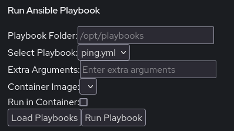
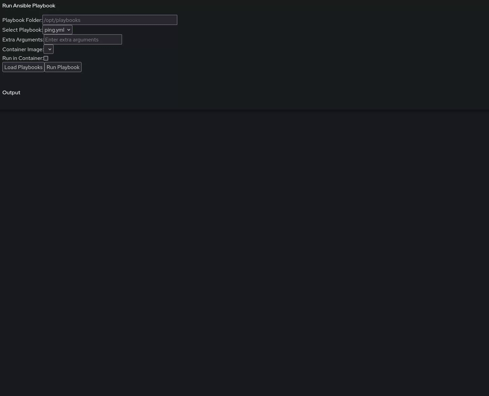

# AnsiblePilot

Cockpit plugin to run Ansible playbooks inside Podman containers.


This cockpit plugin gives the ability to run Ansible playbooks in (or not) a Podman container.
The idea was to get some of the features of AWX but none of the bloat.

## Installation
- Use the included Ansible playbook to install: ```ansible-playbook install-plugin.yml```
- OR - copy the ```AnsiblePilotPlugin``` directory to ```/usr/share/cockpit/AnsiblePilotPluguin```

## Usage


## Requirements
- Cockpit
- Podman (optional if not using containers)
- Ansible (optional if only running playbooks in containers)

## Assumptions
- Looks for .yml or .yaml files in ```/opt/playbooks```
  - Gives the option to change this directory for the current run
  - Can be changed permanently by changing the code
- Looks for container images that have the label ```ansible_execution_environment```
  - That means you have to build your own image and bake that label in
  - This gives the flexibility to assign any mounts/ports/etc you need
  - Sample containerfile, using AlmaLinux 9 and /opt/playbooks for a mount can be found in ```docs/ansible_execution_environment```
- Gives the ability to add extra Ansible parameters at run-time with or without using containers

## Usage Video


## Architecture
This plugin was built using the [Cockpit Starter Kit](https://github.com/cockpit-project/starter-kit) project.
To build your own, the files in ```src``` must be put into the corresponding folder within the starter-kit.
The plugin itself then is generated using a ```make``` command in the starter-kit directory.
More details on this process are on the starter-kit project page.
